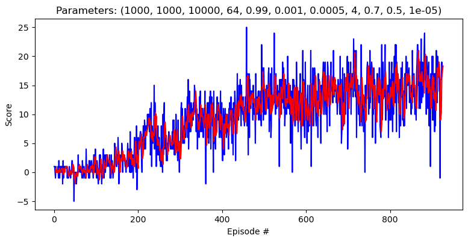

### Introduction

In this repository a Deep Q Network with prioritized experience replay has been implemented to solve the Banana Unity environment. 

Below is a detailed description of the model, the parameters of the model and how it is trained. 


### The model

The model implemented in this repository is based on [Human-level control through deep reinforcement
learning](https://web.stanford.edu/class/psych209/Readings/MnihEtAlHassibis15NatureControlDeepRL.pdf) and [Prioritized Experience replay](https://arxiv.org/abs/1511.05952). 

#### Off-policy training

In particular our model is an off-policy model based on the (original) Q-learning algorithm which uses the following update schema while playing a game: 

$$
Q(S_t, A_t) \leftarrow Q(S_t, A_t) + {learning\_rate} \cdot [R_{t+1} + \gamma \underset{a}{\max}Q(S_{t+1},a) - Q(S_t, A_t)]
$$

Where $S_t$ is the state (of the game) at time $t$, $A_t$ is the action at time $t$, $R_{t+1}$ is the reward at time $t+1$, ${learning\_rate}$ is the rate at which we update the Q function based on new observation, $\gamma$ is how much we discount rewards one (time) step in the future and $\underset{a}{\max}Q(S_{t+1},a)$ is the maximum obtainable $Q(S_{t+1}, \bullet)$ value given state $S_{t+1}$ but with a free choice of the available actions during the training process. The update rule is called off-policy since the update rule is not trying to find the correct value of $Q(s,a)$ for the policy $\pi$ played but instead tries to estimate $Q$ for a strategy that always choose the maximizing action $a$ w.r.t. $Q$.


#### The training policy $\pi$ is $\varepsilon$-greedy

$Q$ is the function that we try to estimate while following some policy $\pi$. Usually we will have that the policy we follow is also changing while trying to estimate $Q$. The particular strategy our agent will follow is an epsilon-greedy strategy meaning that our agent, given a state  $S_t$, will choose the action $\underset{a}{\arg \max}Q(S_{t},a)$ with probability $1-\varepsilon$ and choose a random action with probability $\varepsilon$.

#### A decreasing $\varepsilon$-greedy strategy

The value of $\varepsilon$ is annealed according to the following rule: 

$$
\varepsilon_{t} = \max(0.01, 0.995^{t})
$$

I.e in the beginning of the training process our agent will take a lot of random actions while at the end of the training process the agent will move towards only taking a random action with 1% probability and the rest of the time the agent will choose the action that maximizes the value of the Q function given the current state.

#### Neural network architecture
For simple state-action spaces the $Q$ we can store and update a value for each action-value pair (tabular methods), but when the state-action space becomes high-dimensional this approach becomes computationally infeasible and hence we will need to come up with approximation techniques in order to train our models within reasonable time. One popular way is to approximate the $Q$ value-action function with a neural network and that is also the approach pursued in this implementation. The neural network can be investigated in `model.py`. It is a network with the following architecture: 

$$
a_1 \leftarrow layer1(input)
$$
$$
h_1 \leftarrow ReLu(a_1)
$$
$$
a_2 \leftarrow layer2(h_1)
$$
$$
h_2 \leftarrow ReLu(a_2)
$$
$$
output \leftarrow layer3(h_2)
$$

where $ReLu(x) = \max(0,x)$, $output$ is of dimension 4 and $input$ is of dimension 37. Layer 1-3 in the network are simple feed-forward dense layers that has 64 neurons and each neuron has a bias.

#### Mitigating approximation issues

A couple of issues arises when working with an approximation of $Q$ instead of $Q$ itself. Those are partially mitigated in [Human-level control through deep reinforcement
learning](https://web.stanford.edu/class/psych209/Readings/MnihEtAlHassibis15NatureControlDeepRL.pdf) and two main elementws; double deep q-network and a replay memory. 

##### Double Deep Q-networks

With this approach one network, say $Q_{local}$ is continually updated while training. This network is also used by the agent when choosing how to act given the current state. Another network, $Q_{target}$ will be used to calculate how much the realized gain differs from the estimated gain. Further, since we're now working on an approximation of $Q$ we wish the optimize the paramters, $\theta$, of the model. In practice we optimize the model parameters with the Adam optimizer given the squared loss, hence the modified update rule now looks as follows: 

$$
\theta_{local} \leftarrow \theta_{local} + {learning\_rate} \cdot [R_{t+1} + \gamma Q_{target}(S_{t+1},\underset{a}{\arg\max} Q_{local}(S_{t+1,a})) - Q_{local}(S_t, A_t)] \nabla_{\theta} Q_{local}(S_t, A_t; \theta)
$$

where we have made explicit that $\theta$ are the parameters in the local neural network $Q_{local}$. In practice the above update step is not performed after every action. The update step is controlled by the parameter `UPDATE_EVERY=4`. A value of 4 has proven usful in this setup.

##### Replay memory 

As described above the agent does not update the weights in the local network after every step. Instead they are only updated every 4th step. To complicate things further the above step is also not necessarily learning from the most recent steps the agent has taken. Instead a replay memory, whose size is controlled by `BUFFER_SIZE=10000`, has been implemented, and during the learning phase of the local network samples from this network and learns based on a batch sampled from the replay memory. The batch size was set to 64 and is controlled by the parameter `BATCH_SIZE=64`


#### Updating the target network

In [Human-level control through deep reinforcement
learning](https://web.stanford.edu/class/psych209/Readings/MnihEtAlHassibis15NatureControlDeepRL.pdf) the weights from the local network are occasionally copied to the target network. The implemententation here is slightly different; after every update of the local network we make a soft update of the weights in the local network into the target network using the following scheme: 

$$\theta_{target} \leftarrow (1-\tau) \theta_{target} + \tau \theta_{local}$$

where $\tau$ is controlled by the parameter `TAU` and was set to $\frac{1}{100}$

### Proportional prioritized experience replay

Instead of sampling naively from the replay memory distribution we could be tempted to think that we can learn more from memories which had a higher TD(0) error. Hence, with prioritized experience replay we will samples in the replay buffer that had higher TD(0) error with higher probability than those with a low error. In particular each element will be sampled according to the following probabilties: 

$$P(j) = \frac{p_j^\alpha}{\sum_{i=1}^{BUFFER\_SIZE} p_i^\alpha }$$

where $j$ is an (sampled) element in the replay memory and where $p_j$ is the TD(0) error, i.e. 

$$
p_j = |(R_{j} + \gamma Q_{target}(S_{j},\underset{a}{\arg\max} Q_{local}(S_{j},a)) - Q_{local}(S_{j-1}, A_{j-1}))| + EPS
$$

where $EPS$, governed by `EPS=0.0001`, is a positive constant to avoid that some states will never be revisited and the parameter $\alpha$ determines how much we should weigth the TD(0) errors.

#### Sampling bias

To adjust for the fact that the sampling distribution now longer follows the real world distribution we have to make an adjustment in the update rule as follows: 

$$
\theta_{local} \leftarrow  \theta_{local} + {learning\_rate} \sum_{j=1}^{BATCH\_SIZE} w_j [R_{j}  + \gamma Q_{target}(S_{j},\underset{a}{\arg\max} Q_{local}(S_{j},a)) - Q_{local}(S_{j-1}, A_{j-1})] \nabla_{\theta} Q_{local}(S_{j-1}, A_{j-1}; \theta)
$$


where $w_j$ is our adjustment defined by: 

$$
w_j = (\frac{1}{N \cdot P(j)})^\beta / \max_j w_j
$$

$\max_j w_j$ is a scaling factor putting an upper bound on the $w_j$'s. The parameter $\beta$ determines how much we should compensate the importance sampling weights with. In practice we introduce an annealing strategy of the sampling bias by letting $\beta$ grow towards 1. 

In particular we use the following update rule for beta: 

$$
\beta_t = \frac{t}{N\_EPISODES} + (1-\frac{t}{N\_EPISODES}) \beta_0 
$$

where $N\_EPISODES$  is governed by the parameter `N_EPISODES=1000` and where $\beta_0S$ is governed by the parameter `BETA0=0.5`.

### Sum trees 

As mentioned in [Prioritized Experience replay](https://arxiv.org/abs/1511.05952) we can't allow the the sampling time of the prioritized samples to run in time $O(BATCH\_SIZE)$ . Therefore we follow their advice and implementat a Sum tree data structure which allows us to sample from the replay memory in a prioritized fashion in time $O(\log_2(BATCH\_SIZE))$. The implementatin of the sum tree's are based on the guide [SumTree introduction in Python](https://adventuresinmachinelearning.com/sumtree-introduction-python/)


### Model results

The best model was found to be a model where $\alpha=0.7$ and $\beta=0.5$ which found a solution that ran 100 consecutive episodes with an average score above 15 (well above the required 13 which is the requirement to solve the environment). The model solved an average score above 15 after 926 episodes. Below a plot of the scores over episodes. The red line corresponds to the 3 episode moving average.




### Pseudocode

```python
def lol:
    s = "wolo"
```

$$ \frac{1}{100} $$


| Tables        | Are           | Cool  |
| ------------- |:-------------:| -----:|
| col 3 is      | right-aligned | 1600 |
| col 2 is      | centered      |   12 |
| zebra stripes | are neat      |    1 |